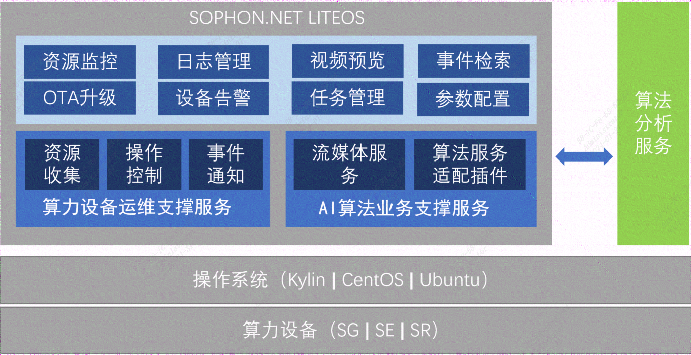

## 0 说明
1. sophliteos分支为基础服务，其中包含了前端和后端代码；输出安装包sophliteos-linux_arm64.tgz   
安装包文件说明参考：[sophliteos安装文件介绍](./doc/sophliteos.md)

2. algoliteos分支为算法插件，仅包含后端代码；输出安装包algoliteos-linux_arm64.tgz  
安装包文件说明参考：[algoliteos安装文件介绍](./doc/algoliteos.md)

## 1 简介

LiteOS 是内置于算能算力设备的轻量WEB服务，提供了设备运行监控、系统升级、日志管理等设备运维基础服务，同时LiteOS 也提供了AI算法业务二次开发框架及集成套件，包括流媒体、算法适配插件、分析事件检索等组件。LiteOS代码全部开源，为生态算法伙伴基于算能算力设备的算法一体机软件服务的搭建、开发，提供便捷的能力支撑。   
 

## 2 安装步骤
1. 安装ssm软件
```bash
tar -xzf bmssm-arm64-v1.2.0.tgz 
cd install
sudo ./deploy-bmssm.sh
```
2. 安装liteos软件
```bash
mkdir sophliteos
cd sophliteos
tar -xzf ../sophliteos-linux_arm64.tgz
sudo ./install.sh
```

3. 安装liteos算法插件
```bash
mkdir algoliteos
cd algoliteos
tar -xzf ../algoliteos-linux_arm64.tgz
sudo ./install.sh
```

4. 安装流媒体(安装包请联系我们获取)
```bash
tar -xzf media_arm.tgz
cd media_arm
sudo ./media_install_arm.sh
sudo systemctl enable docker
```

## 3 算法插件配置
### 3.1 配置文件
```yaml
algoport: "8081" #服务端口信息，不可修改
log:
  path: /var/log/sophliteos  #日志目录，不建议修改
  level: INFO #日志等级
db:
  path: /var/lib/sophliteos/db/algoliteos.db #数据库文件
  savedays: 15 
mediahost: 127.0.0.1:26080 #流媒体服务地址(对应视频资源管理页面->流媒体服务配置中设置)
picture:
  dir: /data/pictures
  maxsize: 1000 #存储图片最大空间，单位MB
algorithmhost: 127.0.0.1:35001 #算法服务的地址(对应任务管理页面->算法服务配置中设置)
uploadhost: 127.0.0.1:8081  #告警上报地址(对应任务管理页面->上报地址配置中设置)
localhost: 127.0.0.1 
abilities:
  1: "车轮泥土检测" #根据算法应用的能力定义进行修改
```
修改配置文件后，需要重启服务生效
```bash
sudo systemctl restart algoliteos.service
```